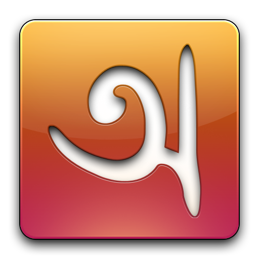
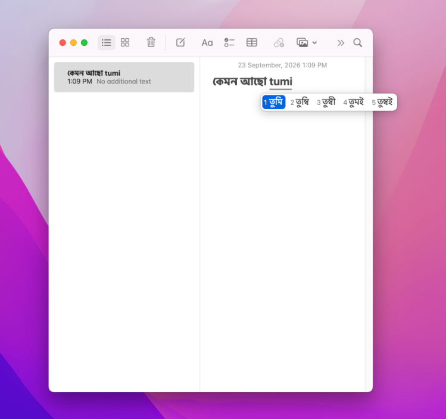
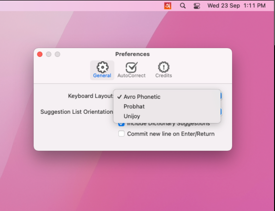
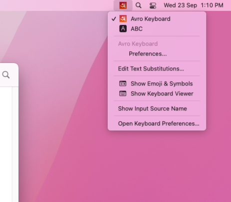
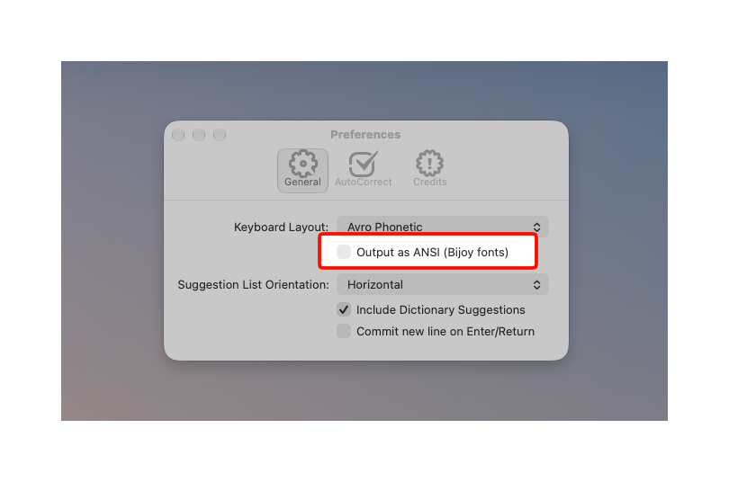
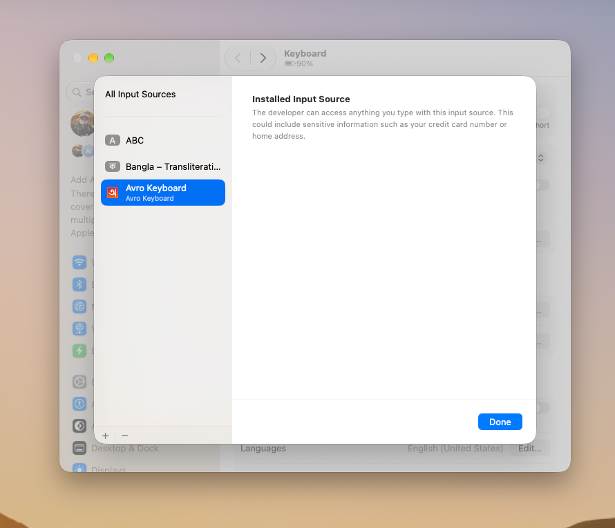
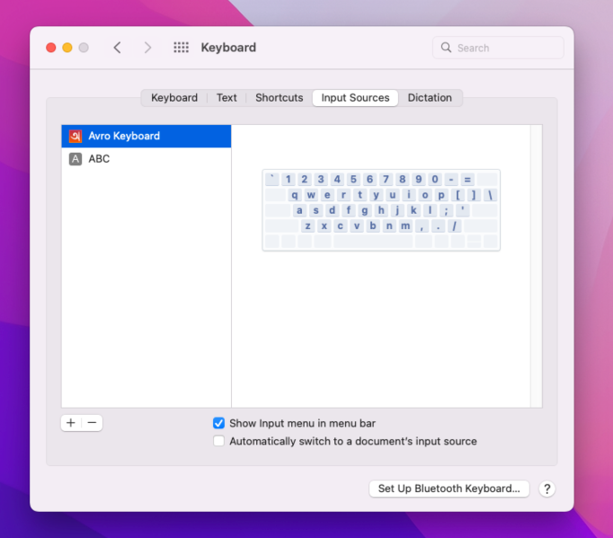

<p align="center">
  
</p>

<h1 align="center">Avro Keyboard for macOS</h1>

<p align="center">
  A native Bangla input method for the Mac, with Avro Phonetic, Probhat and Unijoy layouts,
  and Unicode or ANSI (Bijoy) output.
</p>

<p align="center">
  <a href="https://github.com/AminulBD/iAvro/releases/latest"><strong>Download</strong></a> ·
  <a href="https://avro.aminul.dev/">Website</a> ·
  <a href="https://github.com/AminulBD/iAvro/issues">Report an issue</a>
</p>

<p align="center"><sub>
  The Avro Keyboard name and logo are © <a href="https://www.omicronlab.com">OmicronLab</a>, all rights reserved.
  This is an independent, community-maintained fork. With heartfelt gratitude to Mehdi Hasan Khan
  and the OmicronLab team, whose work made Bangla typing free and accessible to millions.
</sub></p>

---

> [!IMPORTANT]
> **Had the original iAvro installed?** Remove it before installing this
> version, or two **Avro Keyboard** entries show up in the input menu and macOS
> may keep loading the old one. See [Removing the old version](#removing-the-old-version).

> [!TIP]
> **New: ANSI (Bijoy) output.** Avro can now type in the legacy Bijoy encoding
> for SutonnyMJ and other Bijoy fonts, with all three layouts. See
> [ANSI (Bijoy) output](#ansi-bijoy-output).

- [Screenshots](#screenshots)
- [Keyboard layouts](#keyboard-layouts)
- [ANSI (Bijoy) output](#ansi-bijoy-output)
- [Supported macOS versions](#supported-macos-versions)
- [Installation](#installation)
  - [Removing the old version](#removing-the-old-version)
  - [Homebrew](#homebrew)
  - [Manual](#manual)
- [Building](#building)
- [Continuous integration](#continuous-integration)
  - [Releases](#releases)
  - [Signing and notarization](#signing-and-notarization)
- [License](#license)

## Screenshots

<p align="center">
  
</p>

<p align="center">
  
  
</p>

Type phonetically and pick a spelling from the candidate bar, or switch to the
Probhat or Unijoy layout under **Preferences… › Keyboard Layout**.

## Keyboard layouts

Three layouts are available. Pick one under **Preferences… › Keyboard Layout**;
the switch applies from the next key you press.

| Layout | How it works |
| --- | --- |
| **Avro Phonetic** (default) | Write Bangla in Latin letters the way it sounds: `ami` becomes আমি. Candidates, dictionary suggestions and auto-correct work with this layout only. |
| **Probhat** | Every key types a Bengali letter directly: <kbd>k</kbd> ক, <kbd>v</kbd> আ, <kbd>/</kbd> hasanta. The key map is the same as Probhat in Avro Keyboard for Windows. |
| **Unijoy** | The Bijoy-style layout: <kbd>j</kbd> ক, <kbd>f</kbd> া, <kbd>g</kbd> hasanta, following the m17n `bn-unijoy` table. <kbd>g</kbd> before a vowel-sign key makes the full vowel, so <kbd>g</kbd> <kbd>f</kbd> gives আ. Press <kbd>g</kbd> twice for a visible hasanta. |

With Probhat and Unijoy:

- Text is typed in Unicode order, with a vowel sign after its consonant: কি is
  ক then ি, even though ি is drawn first.
- Keys are read as they would be on a US keyboard, so use a US (ABC) keyboard
  layout alongside it.
- The Option (AltGr) layer is not included yet. For Unijoy this covers ZWJ/ZWNJ
  and the ্য / র‍্য shortcuts; the full vowels are still available with
  <kbd>g</kbd>.
- The suggestion list, dictionary and Enter options in Preferences apply only to
  Avro Phonetic, and are greyed out while a fixed layout is selected.

## ANSI (Bijoy) output

Turn on **Preferences… › Output as ANSI (Bijoy fonts)** to type in the legacy
Bijoy encoding used by SutonnyMJ and other Bijoy fonts, instead of Unicode. It
works with all three layouts, and the conversion is the same as in Avro Keyboard
for Windows. Set a Bijoy font in the document, or the text will show as Latin
letters.

<p align="center">
  
</p>

- With Avro Phonetic, the word you pick from the candidate bar is converted as
  it is committed.
- With Probhat and Unijoy, the word you are typing stays underlined, already
  shown in Bijoy, until you press space, Return or another key outside the
  layout. Bijoy puts some vowel signs before their consonant, so a word can only
  be converted as a whole. <kbd>Delete</kbd> removes the last key you typed.

## Supported macOS versions

Avro Keyboard runs on macOS 12 Monterey and every later release, on Apple
silicon (M1, M2, M3, M4 and later) and Intel Macs, from a single universal
build.

| macOS | Name | Apple silicon | Intel |
| --- | --- | --- | --- |
| macOS 27 | Golden Gate | ✅ | — |
| macOS 26 | Tahoe | ✅ | ✅ |
| macOS 15 | Sequoia | ✅ | ✅ |
| macOS 14 | Sonoma | ✅ | ✅ |
| macOS 13 | Ventura | ✅ | ✅ |
| macOS 12 | Monterey | ✅ | ✅ |

macOS 27 Golden Gate no longer runs on Intel Macs; on an Intel Mac, Avro
Keyboard works up to macOS 26 Tahoe. macOS 11 Big Sur and earlier are not supported.

## Installation

### Removing the old version

> [!IMPORTANT]
> If you had the original iAvro (bundle identifier
> `com.omicronlab.inputmethod.AvroKeyboard`) installed, remove it first.
> Otherwise two **Avro Keyboard** entries show up in the input menu and macOS
> may keep loading the old one.

1. Open **System Settings › Keyboard › Input Sources › Edit…** and remove
   **Avro Keyboard** from the list.
2. Delete the old app. It lives in one of these folders (in Finder press
   <kbd>⌘</kbd> <kbd>⇧</kbd> <kbd>G</kbd> and paste the path):

   ```sh
   rm -rf ~/Library/Input\ Methods/Avro\ Keyboard.app
   sudo rm -rf /Library/Input\ Methods/Avro\ Keyboard.app
   ```

3. Log out and back in, then install the new version as described below.

> [!NOTE]
> Your personal dictionary and preferences from the old version are not carried
> over; they were stored under the old bundle identifier.

### Homebrew

```sh
brew install --cask aminulbd/tap/avro
```

This installs `Avro Keyboard.app` into `~/Library/Input Methods`. After
installing, switch to it from the input menu in the menu bar.

| Task | Command |
| --- | --- |
| Upgrade | `brew upgrade --cask avro` |
| Remove | `brew uninstall --cask avro` |

### Manual

1. Download `Avro-Keyboard-universal.dmg` from the
   [Releases](https://github.com/AminulBD/iAvro/releases) page, or the
   `apple-silicon` / `intel` build for your Mac.
2. Open the DMG, double-click **Avro Keyboard** and click **Install**. It is
   copied into `~/Library/Input Methods` and added to your input sources.
3. Switch to it from the input menu in the menu bar.

> [!TIP]
> To install for all users instead, copy the app into `/Library/Input Methods`
> by hand, then log out and back in.

If it does not appear in the input menu, log out and back in, then open
**System Settings › Keyboard › Input Sources › Edit… › +**, choose
**Bangla › Avro Keyboard**, and click **Add**. On macOS 12 the same list is under
**System Preferences › Keyboard › Input Sources**.

<p align="center">
  
  
</p>
<p align="center"><sub>Input Sources on macOS 13 and later (left) and macOS 12 (right)</sub></p>

## Building

Open `AvroKeyboard.xcodeproj` in Xcode and build the **Avro Keyboard** scheme,
or from the command line:

```sh
xcodebuild -project AvroKeyboard.xcodeproj \
  -scheme "Avro Keyboard" \
  -configuration Release \
  -derivedDataPath build
```

- **Requirements:** Xcode 16+, macOS 12.0+
- **Dependencies:** none; SQLite comes from the system `libsqlite3`
- **Output:** `build/Build/Products/Release/Avro Keyboard.app`
- **Bundle identifier:** `app.aminul.inputmethod.AvroKeyboard`

## Continuous integration

Pushing a tag starting with `v`, or running the **Build** workflow manually
from the Actions tab, builds Release binaries for Apple Silicon (`arm64`),
Intel (`x86_64`) and a universal binary. Each is uploaded as a workflow
artifact: a `.dmg` installer and a `.zip` of the bare app.

### Releases

Push a tag starting with `v` to publish a release:

```sh
git tag v1.6.0
git push origin v1.6.0
```

Once all three builds finish, a GitHub release is created for that tag with the
DMGs and zips attached and auto-generated release notes.

### Signing and notarization

When the following repository secrets are set, CI signs the app with your
Developer ID certificate, submits it to Apple for notarization, and staples the
ticket before uploading.

> [!WARNING]
> Without these secrets the app is ad-hoc signed, and Gatekeeper will block it
> on other Macs.

| Secret | Value |
| --- | --- |
| `MACOS_CERTIFICATE_P12` | Base64 of a `.p12` export of your **Developer ID Application** certificate (with private key): `base64 -i cert.p12 \| pbcopy` |
| `MACOS_CERTIFICATE_PASSWORD` | Password used when exporting the `.p12` |
| `APPLE_TEAM_ID` | 10-character Team ID from <https://developer.apple.com/account> |
| `APP_STORE_CONNECT_KEY_ID` | Key ID of an App Store Connect API key |
| `APP_STORE_CONNECT_ISSUER_ID` | Issuer ID shown on the API keys page |
| `APP_STORE_CONNECT_API_KEY_P8` | Full contents of the downloaded `AuthKey_XXXXXXXXXX.p8` file |

To create the API key, go to **App Store Connect › Users and Access ›
Integrations › App Store Connect API › Team Keys › +** and pick the
**Developer** role (or higher).

> [!NOTE]
> The `.p8` file can only be downloaded once.

## License

Avro Keyboard for Mac is licensed under the [Mozilla Public License 1.1](LICENSE).
Copyright © 2026 OmicronLab. All rights reserved.
